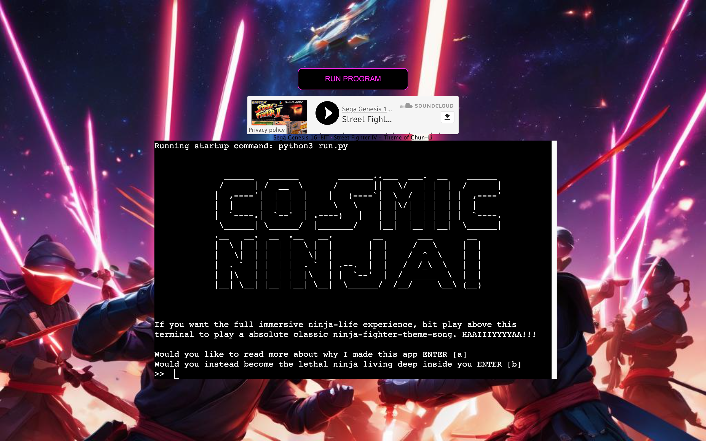
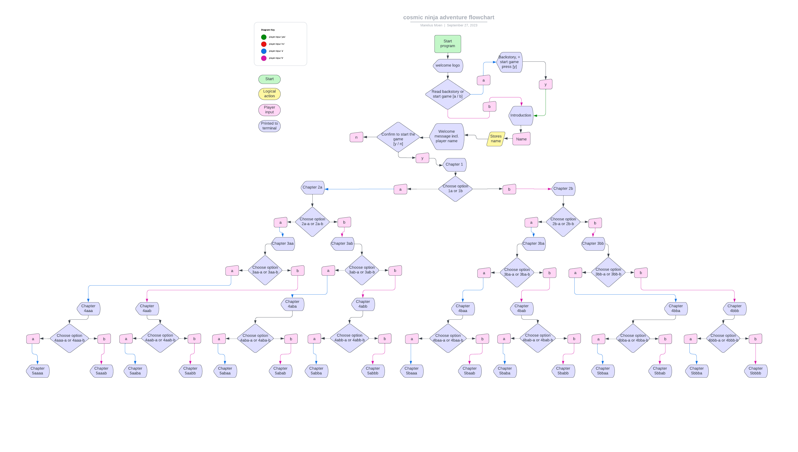
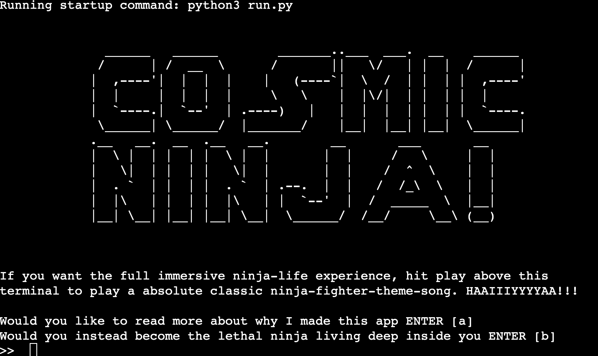
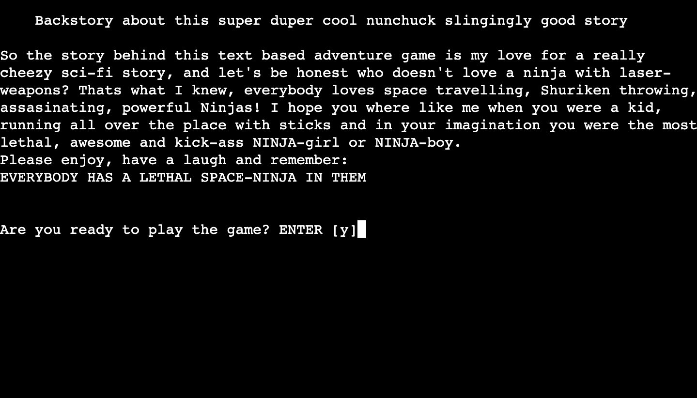
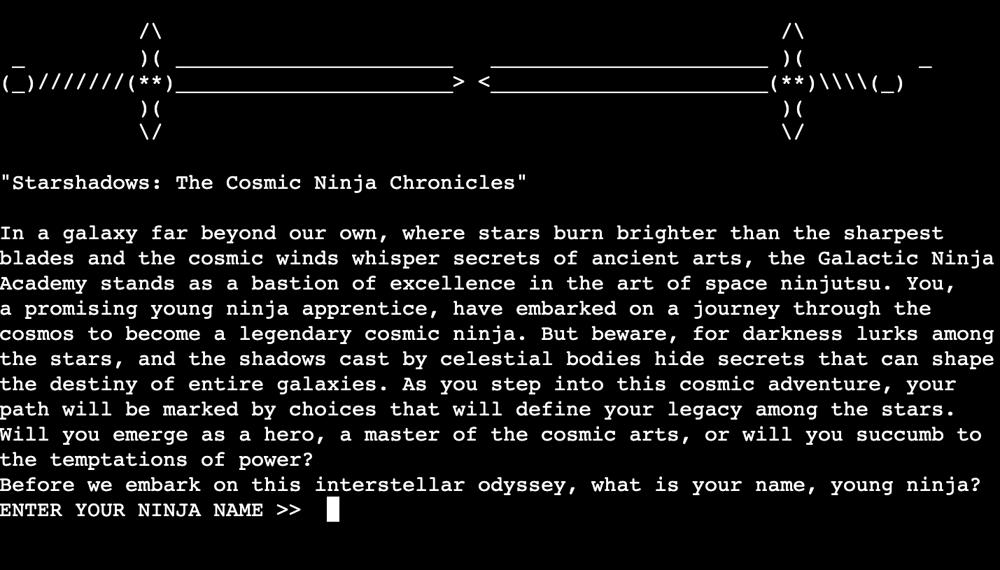
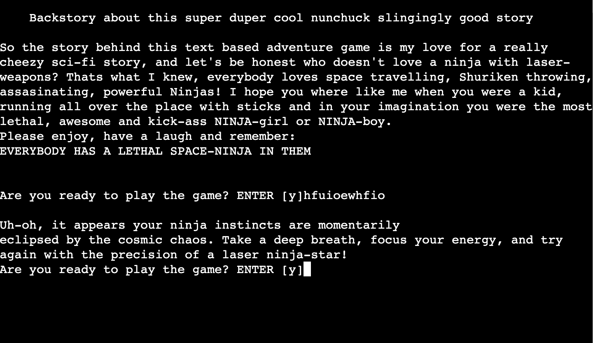
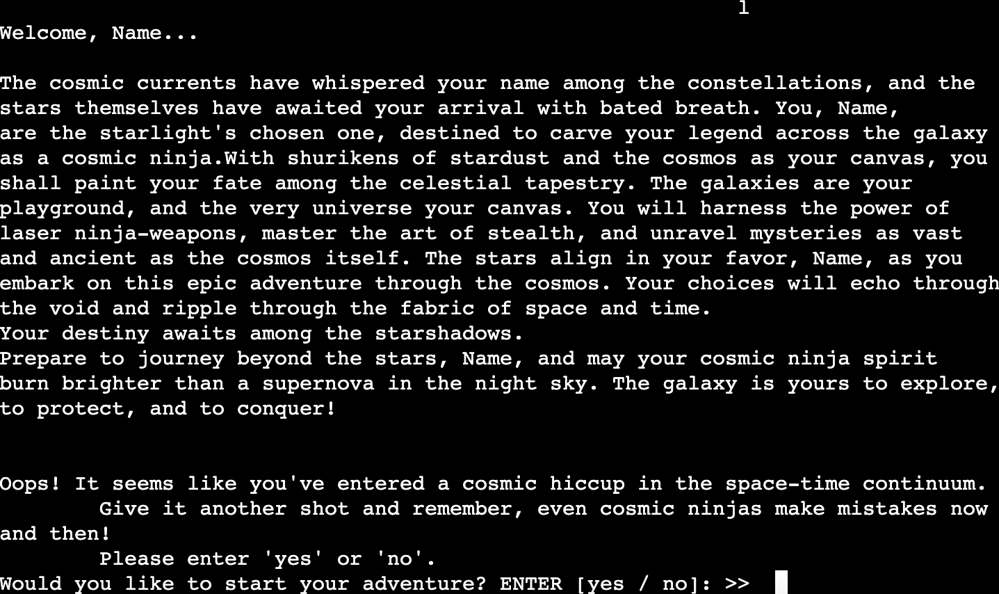
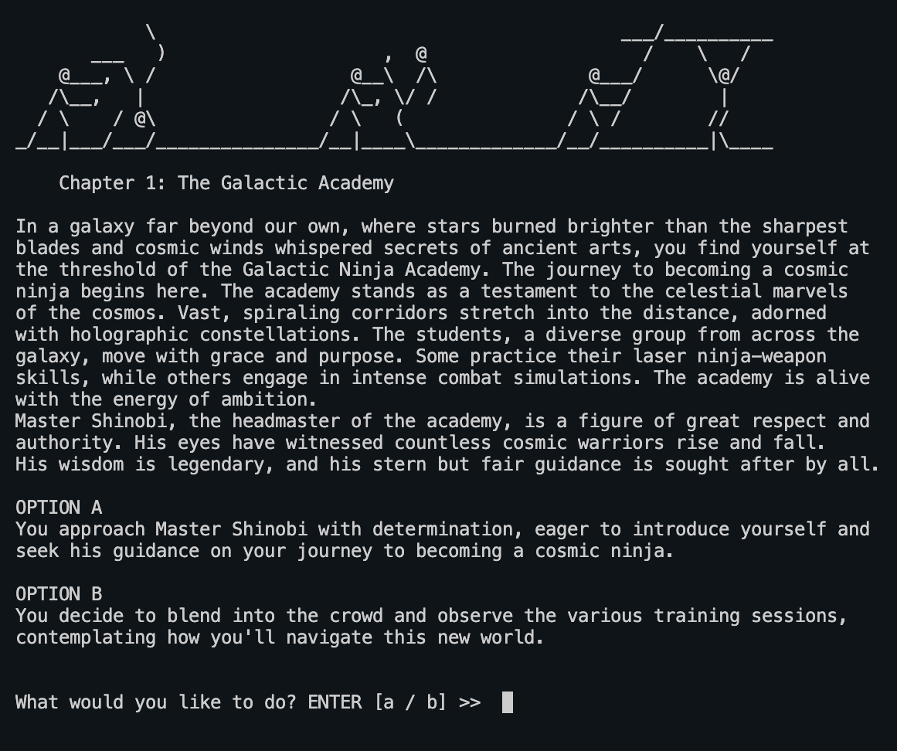

# Cosmic Ninja Adventure

This python project is made to give the user a good laugh and hopefully remind them of a childhood filled with imagination, epic stories that filled our minds and took us on amazing adventures in everyday life.
I guess you could say this story is a bit childish, but I believe for a text based adventure game
we all have to find our inner child and use our imagination for it to be engaging since the visual and audiotory stimuli is not very present.
The story itself is created by AI with Chatgpt (https://chat.openai.com/), I gave it my requirements for the story:
- Ninjas wielding laser weapons.
- It's set to space.
- Devided into chapters and the player should get options at the end of each chapter, and depending on the choice made the storyline takes a new direction. Example:
- Chapter 1 the player chooses option A.
- The player is then shown chapter 2A because of his/her choice in chapter 1, and is the presented with two new options; A or B.
- The player chooses option B.
- Because of this choice the next chapter shown is 3AB, and so the story progresses.
During the construction I asked the AI for the next chapter depending of the previous choices and added any new requirements that I felt like along the way, in the end there's 16 totally different endings to the game.

## Demo
Link to the live site: https://cosmic-ninja-adventure-b7514defc13d.herokuapp.com/ 

## User Stories
This app is created for anyone with a special interest in any of its topics or the text based adventure game genre, among them:
- **Text based adventure game fans,** all of the people that miss the 'good old days' when you had to use your own imagination and nobody talked about game graphics (or if they did it was made up of letters, numbers, symbols and spaces). 
- **Those seeking a trip down memory lane,** anyone who played a computer game in the 80s or early 90s with all it's charm, ingenuity and mindblowing storylines, when people smoked inside, moustaches were the coolest thing for any man (it still is, but whatever..) and everybody looked like George or Elaine from the Seinfeld tv show. For those who want to reminisce about a time without all the grown-up issues of 2023 (or maybe just less of them) and just submerge their mind in epic laser-katana-sword-swinging ninjas!
- **For the new generation that never have to use their imagination anymore,** those that have no imagination because everything is in 4K, 3D with a splash of sorroundsound in their life. This is a great oppertunity to see the humble beginnings of what so many of us love today!
- **For the Ninja-enthusiast,** those that dress up as a ninja for halloween every year withuot exception, those that jumps down from the 2nd floor instead of taking the stairs because the stairs are 'not very ninja'.
- **For those that have litterally seen everything on the world-wide-web,** just those that feel like they have completed 99.9% of the internet and happend to come across this game.

## Strategy
???????

## Wireframe/Flowchart

### Welcome screen

### Backstory screen

### Introduction and name choice screen

### Wrong input screen

### Chapter with options

### Background image and favicon image
The back ground image is created by AI for free at https://gencraft.com/, the requirements  I gave the AI was "50 ninjas in space fighting with laser weapons".
It gave me both the background image and the favicon image that is in the same style and color-scheme.

## Technologies
????

## Features
### 1st Welcome screen
Here the user will se a ASCII art 'COSMIC NINJA', and have two choices:
- Read the backstory of the app.
- Start the game.

#### Backstory screen
Here the user will read a short text about what I had in mind when I created the app, and just a little bit of explaining how the story came about.

The app has:
?????

### Screenshots

## Features left to implement

## Testing

## Validator testing

## Bugs

## Unsolved bugs

## Deployment
## ***Final Deployment to Heroku:***  
  
The project was deployed to [Heroku](https://www.heroku.com) using the below procedure:-    
  
**Log in to Heroku** or create an account if required.
**click** the button labeled **New** from the dashboard in the top right corner, just below the header.
From the drop-down menu **select "Create new app"**.
**Enter a unique app name**. I combined my GitHub user name and the game's name with a dash between them (dnlbowers-battleship) for this project.
Once the web portal shows the green tick to confirm the name is original **select the relevant region.** In my case, I chose Europe as I am in Malta.
 When happy with your choice of name and that the correct region is selected, **click** on the **"Create app" button**.
This will bring you to the project "Deploy" tab. From here, navigate to the **settings tab** and scroll down to the **"Config Vars" section**. 
**Click** the button labelled **"Reveal Config Vars"** and **enter** the **"key" as port**, the **"value" as 8000** and **click** the **"add"** button.
Scroll down to the **buildpacks section of the settings page** and click the button labeled **" add buildpack," select "Python," and click "Save Changes"**.
**Repeat step 11 but** this time **add "node.js" instead of python**. 
   * ***IMPORTANT*** The buildpacks must be in the correct order. If node.js is listed first under this section, you can click on python and drag it upwards to change it to the first buildpack in the list.
Scroll back to the top of the settings page, and **navigate to the "Deploy" tab.**
From the deploy tab **select Github as the deployment method**.
**Confirm** you want to **connect to GitHub**.
**Search** for the **repository name** and **click** the **connect** button next to the intended repository.
From the bottom of the deploy page **select your preferred deployment type** by follow one of the below steps:  
Clicking either "Enable Automatic Deploys" for automatic deployment when you push updates to Github.  
Select the correct branch for deployment from the drop-down menu and click the "Deploy Branch" button for manual deployment. 

## Credits
#### Deployment description in this readme.md file is from dnlbowers and his battleship apps readme.md file
https://github.com/dnlbowers/battleships/tree/main

#### multiple choice gives multiple choice again inspiration and the occational code snippet:
https://www.youtube.com/watch?v=YPFss7hYBmg
https://stackoverflow.com/questions/49455318/calling-multiple-functions-based-on-user-selection-in-python
https://stackoverflow.com/questions/17166074/most-efficient-way-of-making-an-if-elif-elif-else-statement-when-the-else-is-don
https://stackoverflow.com/questions/54608432/how-to-use-while-loops-with-multiple-if-elif-statements
https://stackoverflow.com/questions/28443164/compound-if-elif-else-statements-python

#### Making the ASCII logo for gamestart page:
https://patorjk.com/software/taag/#p=display&h=1&v=1&c=vb&f=Star%20Wars&t=cosmic%0Aninja!%0A%0A%0A

#### ASCII art from:
https://ascii.co.uk/art/

#### Background image generated for free with ai by site:
https://gencraft.com/

#### Favicon generated for free by site:
https://gencraft.com/

#### Styling of the display (background, positioning of terminal and 'run button'from:
https://github.com/dnlbowers/battleships/blob/main/views/layout.html
